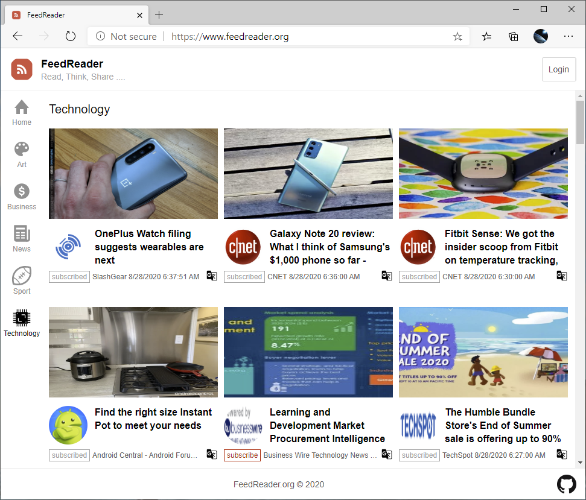
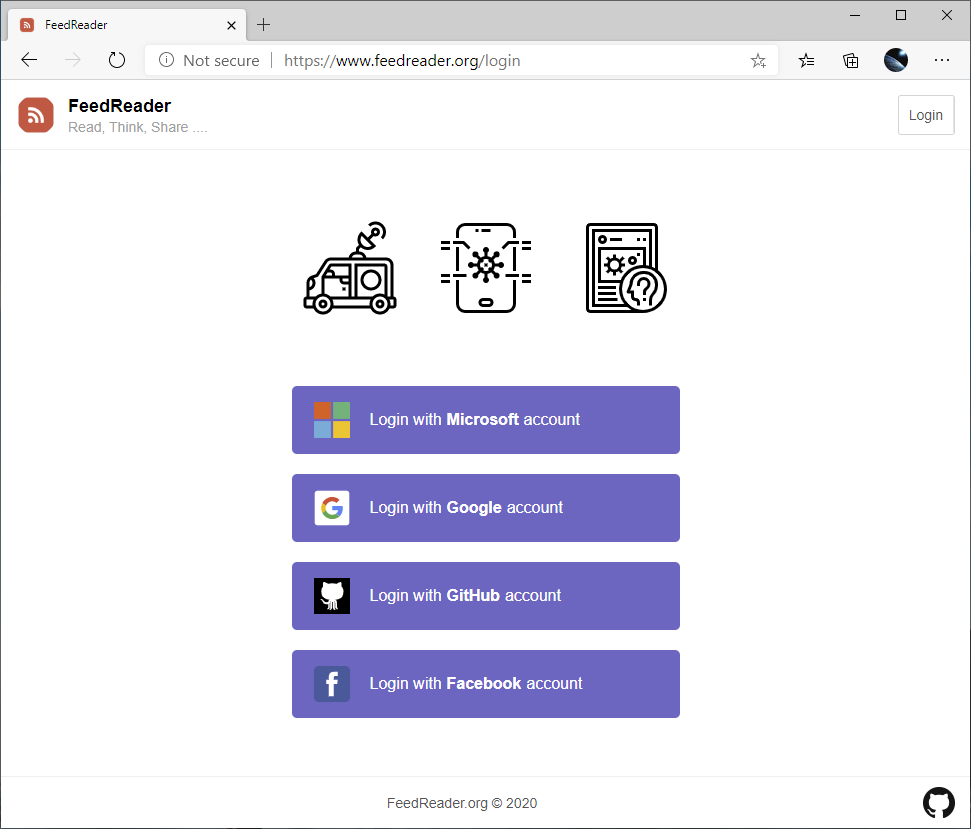
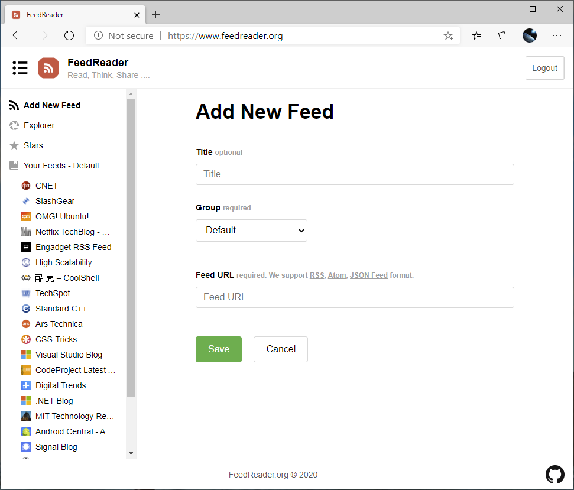
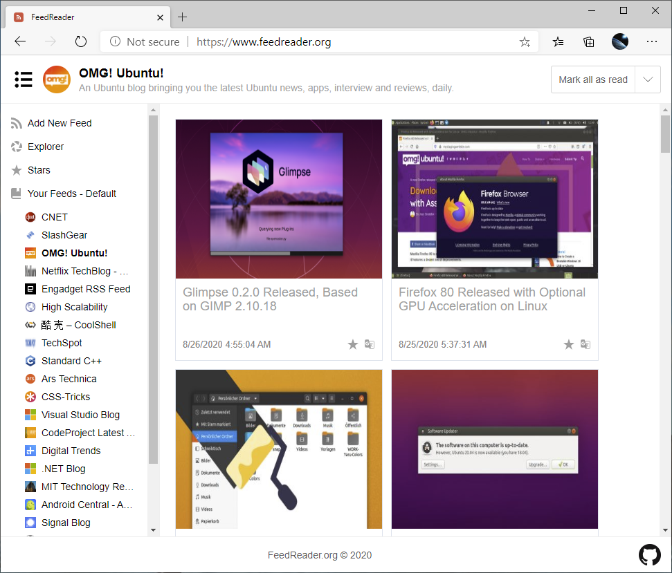

FeedReader
==

This is a learning project. The target goal is building an online web feed reader with blazor web assembly
and azure functions.

## Goal

- Client is built with blazor web assembly. It's a single page application (SPA) which can be loaded by the
  browser and exected inside the browser.
- Server cost should be the lower the better. If possible, avoid any "pay by hours" service, only select
  "pay as you go" service.
- Support third-pary account login. E.g, Microsoft account, GitHub account, Google account, Facebook account. Don't handle
  user registration. It's annoying to user to register a new account again and again.
- Support RSS, ATOM, Json Feed standard.
- Free! Free! Free!
- Maybe more ... 

## Screen Shots

Website: https://www.feedreader.org

## Get Started

1. Install [VS 2019](https://visualstudio.microsoft.com/vs/). Community version is good enough.
   Install `ASP.NET and web development` workload. Make sure `Cloud tools for web development` is also selected.

1. Install [DotNet SDK 5.0 Preview 8](https://dotnet.microsoft.com/download/dotnet/5.0).

1. Use the following command to clone the source code:

        git clone --recursive https://github.com/feedreaderorg/feedreader.git

1. Start `Microsfot Azure Storage Emulator` from start menu. Or you can run the following command directly:

        C:\Program Files (x86)\Microsoft SDKs\Azure\Storage Emulator>AzureStorageEmulator.exe start

1. Go to `feedreader/Server`, copy `local.settings.example.json` to `local.settings.json`.

1. Go to `feedreader/Server`, launch `FeedReader.Server.sln`, run `FeedReader.WebApi` project.

1. Go to `feedreader`, launch `FeedReader.sln`, run `FeedReader.WebClient` project. It should launch your
   browser and navigate to `https://localhost`.
